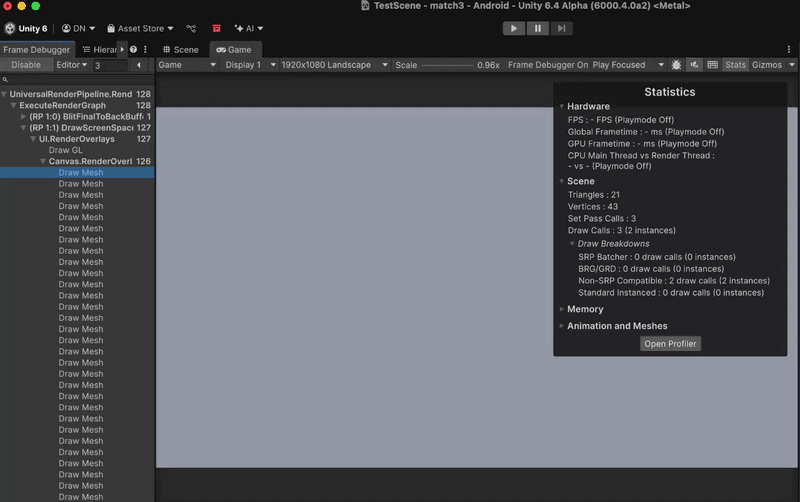

## UI Defragmentation and Batching

UI layout can have a big impact on Unity's ability to batch renderers. Unity's batcher must respect the hierarchy to avoid breaking the render order. Non-overlapping UI elements can be batched by material. But tiny pixel overlaps can easily break this batching! At which point, the order matters a lot. 

I used a simple script to "defragment" a given UI panel and it's child elements. Looking at the element's rect transform and atlas, we can re-order elements to improve batching.  Before re-ordering the elements, we see over 100 draw calls:

  

After a simple re-ordering, we can draw all sprites with just 2 draw calls:

  

Warning: the defragmentation script in this project is only meant for demonstration purposes. It is still recommend to manually order your UI eleements to maximize the effeciency of Unity's SRP batcher. You can attach the script and click the "Defragment Atlas" button to automatically re-order UI elements under the same planel, to prioritize batching based on material. Doing so will break the UI layout!
